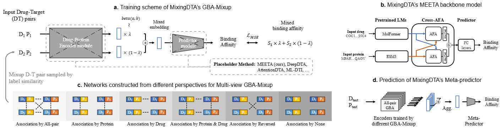
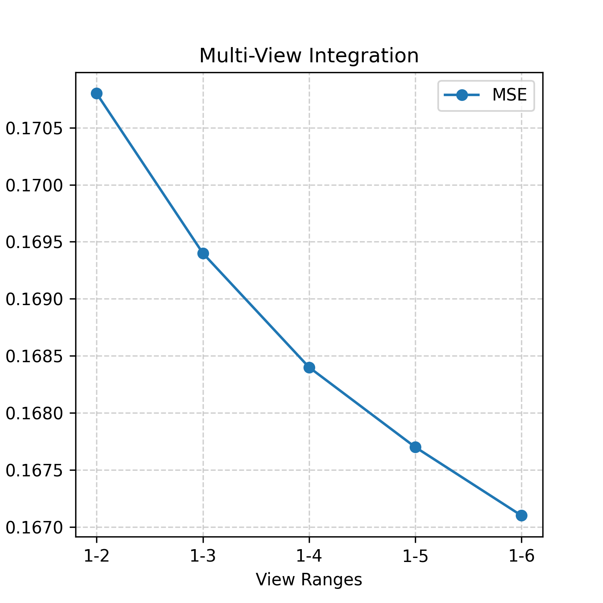

# MixingDTA
This GitHub repository provides the source code for the MixingDTA[1]. It is intended for academic purposes.


## Overview of MixingDTA


Overview of MixingDTA; a. Two DT pairs are input, and the mixing ratio is sampled from a Beta distribution for training like C-Mixup; b. The default backbone model of MixingDTA is MEETA. It utilizes embeddings from pretrained language models. Cross-AFA efficiently processes through AFA from a computational cost perspective; c. Edges between DT pairs are connected based on the criteria for defining neighbors. Neighbors with similar labels are closer, following the C-Mixup method. For each view, new nodes are augmented between DT nodes, creating mixed embeddings that are then trained; d. This is a step of multi-view integration. The embeddings are extracted from encoders trained on each GBA scenario and fed into the FC layers of MEETA.

## Prerequisites for running MixingDTA

```
conda create -n MixingDTA python=3.10

pip install transformers
pip install biopython
conda install pytorch==2.3.1 torchvision==0.18.1 torchaudio==2.3.1 pytorch-cuda=12.1 -c pytorch -c nvidia
pip install esm # for ESM-3 open small version
pip install ipykernel
pip install PyTDC==1.0.7
pip install easydict
pip install lifelines==0.27.3
pip install scikit-learn==1.2.2
conda install -c conda-forge rdkit=2023.9.6
```

For more detailed environment configuration, refer to `requirements.txt`.

## Processing datasets

The DAVIS and KIBA datasets were downloaded from [TDC](https://tdcommons.ai/multi_pred_tasks/dti) and processed. They are provided in the `DTA_DataBase` directory of this GitHub repository as pickle files, pre-split for 5-fold cross-validation.

### Extract embeddings from Pre-trained LMs
The embeddings corresponding to Drug SMILES and protein sequences are extracted from pretrained models. The code for extraction is made available. `drug_ids.pkl` and `protein_ids.pkl` serve as inputs for these codes. They are in dictionary format, where the keys are IDs and the values are strings.

```
cd ./DTA_DataBase/MolFormer/make_embeddings.py
python ./make_embeddings.py

cd ./DTA_DataBase/ESM3_open_small/make_embeddings.py
python ./make_embeddings.py

```

For academic details on protein embeddings, refer to [2].

### Google Drive

mask_matrix and trained parameters of MixingDTA are given in

```
https://drive.google.com/drive/folders/1rdclHh9DeYL3rcoGP-73cGx2MOn95BLO?usp=drive_link
```


## Training

### Step 1: Training with GBA Perspectives
Refer to part c of the "Overview of MixingDTA" figure.  
The model is trained one by one on six different cases.  

Move to the directory of MEETA, the default backbone model of MixingDTA.
```


python ./main.py --device ${YOUR_GPU_NUM} --case 1 --dataset ${DAVIS_OR_KIBA}

python ./main.py --device ${YOUR_GPU_NUM} --case 2 --dataset ${DAVIS_OR_KIBA}

python ./main.py --device ${YOUR_GPU_NUM} --case 3 --dataset ${DAVIS_OR_KIBA}

python ./main.py --device ${YOUR_GPU_NUM} --case 4 --dataset ${DAVIS_OR_KIBA}

python ./main.py --device ${YOUR_GPU_NUM} --case 5 --dataset ${DAVIS_OR_KIBA}

python ./main.py --device ${YOUR_GPU_NUM} --case 6 --dataset ${DAVIS_OR_KIBA}

```

### Step 2: Meta-Predictor Training
This step is "Multi-View integration".

```
python ./main.py --device ${YOUR_GPU_NUM} --play integration --dataset ${DAVIS_OR_KIBA}

```
Including cases progressively from the first perspective up to the sixth leads to improved performance in terms of MSE.  
This experimental result is based on the MSE of the random split on the DAVIS dataset.  
Refer to the "Multi-View Integration" figure below.




## Model-agnostic experiment
The model-agnostic experiments include the simplest model, [DeepDTA](https://github.com/hkmztrk/DeepDTA)[3].  
This is available in the DeepDTA directory, and the input command is identical to the one in the Training section.  


## etc
The version of ESM-3 we used is `esm3-open-small` with 1.4B parameters.  
It is the smallest and fastest model in the ESM-3 family.  

<!--
## Licenses
The embeddings and training results derived from esm3-open-small are provided under the [Cambrian non-commercial license](https://www.evolutionaryscale.ai/policies/cambrian-non-commercial-license-agreement). For more details, refer to the following URLs: 
https://github.com/evolutionaryscale/esm?tab=readme-ov-file
https://github.com/evolutionaryscale/esm/blob/main/LICENSE.md

Meanwhile, MolFormer was used to extract embeddings via the Hugging Face API. Refer to [https://huggingface.co/ibm/MoLFormer-XL-both-10pct](https://huggingface.co/ibm/MoLFormer-XL-both-10pct) for more details. MolFormer is distributed under the Apache License 2.0.
 -->

## References
[1] [MixingDTA] 

[2] [Simulating 500 million years of evolution with a language model]

```
@article{hayes2024simulating,
  title={Simulating 500 million years of evolution with a language model},
  author={Hayes, Tomas and Rao, Roshan and Akin, Halil and Sofroniew, Nicholas J and Oktay, Deniz and Lin, Zeming and Verkuil, Robert and Tran, Vincent Q and Deaton, Jonathan and Wiggert, Marius and others},
  journal={bioRxiv},
  pages={2024--07},
  year={2024},
  publisher={Cold Spring Harbor Laboratory}
}
```

[3] [DeepDTA]
```
@article{ozturk2018deepdta,
  title={DeepDTA: deep drug--target binding affinity prediction},
  author={{\"O}zt{\"u}rk, Hakime and {\"O}zg{\"u}r, Arzucan and Ozkirimli, Elif},
  journal={Bioinformatics},
  volume={34},
  number={17},
  pages={i821--i829},
  year={2018},
  publisher={Oxford University Press}
}
```